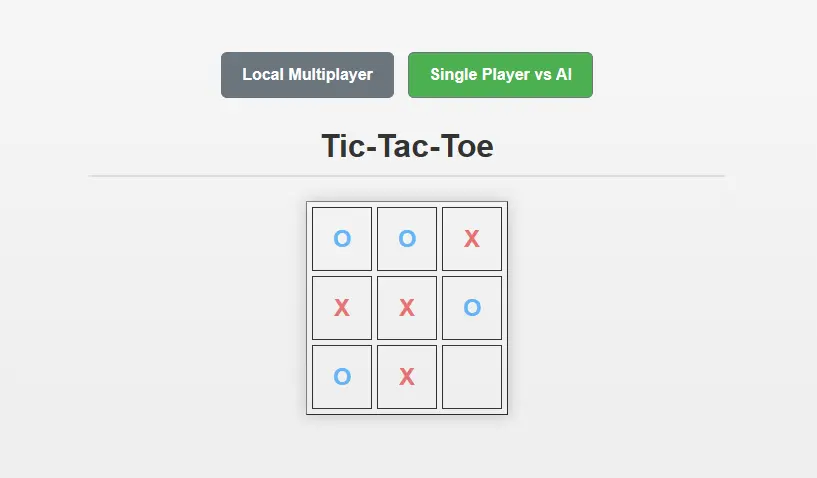

# Tic-Tac-Toe

**Author**: Lemuel Nogueira

## Overview
This repository contains the source code for a web-based Tic-Tac-Toe game. The game features both local multiplayer and single-player modes, where the single-player mode pits the human player against an AI opponent. The game is built using HTML, CSS, and JavaScript, with a particular emphasis on JavaScript for gameplay logic.

## Features
- **Local Multiplayer**: Two players can play on the same device, taking turns.
- **Single Player vs AI**: Play against a simple AI opponent.
- **Responsive Design**: The game layout is responsive, making it suitable for both desktop and mobile browsers.
- **Stylish UI**: The game interface is styled using CSS with hover effects, making it visually appealing and user-friendly.

## Files
1. **index.html**: The main HTML file that structures the game.
2. **styles.css**: Contains CSS styles for the game's appearance.
3. **script.js**: JavaScript file that contains the logic for the game mechanics and AI.

## Setup
To set up the game on your local machine:

1. Clone this repository or download the files.
2. Open `index.html` in a web browser.

No additional installation is required, as the game runs entirely in the browser.

## Usage
Upon opening `index.html`, you will see the game's main interface. You can choose between local multiplayer or single-player modes. In the single-player mode, you play against the AI.

Click on a square to make a move. The game will indicate when a player wins or if the match is a draw. The board resets automatically for a new game after each match.

## Dependencies
- **Bootstrap 5.3.2**: For styling and responsive design.
- **jQuery 3.7.1**: For simplified JavaScript coding.

These dependencies are loaded via CDN and do not require manual installation.

#

Enjoy the game! 🎮
